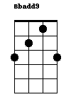

# ThatChord: A Python script for chord diagrams

**Created by Tom Conti-Leslie: [tomcontileslie.com](http://tomcontileslie.com).**

**These files are distributed under a Creative Commons Share Alike license.**

[](https://creativecommons.org/licenses/by-sa/4.0/)

## What is ThatChord?

That's exactly the question I ask myself a lot when I'm looking at a chord sheet for a song I'm learning, and the key it's in is bad
enough that some pretty obscure chord names are in there. This simple set of interdependent Python3 scripts allows you to copy
the name of an unknown chord into ThatChord, and have it output one or several diagrams which show you exactly how to play it.

My motivation to make this script came from the restricted capabilities of most currently available online chord tools, as well as a few idle hours
I once had on a plane with no internet. With ThatChord, your chosen instrument's number of strings and tuning, as well as your preferred output 
diagram format and preferences regarding muted strings and so on are *fully customisable*, with a number of presets available.

ThatChord supports a large list of chord qualities (see `dicts.py`), as well as chord alterations and bass notes - and, failing that, custom note-by note input. 
Strings such as `C`, `Fadd9` and `Bmin11(b5)/C` are all recognised and on guitar, produce delightfully simple plaintext diagrams such as:
```
   x
   ===========        x           
   | | | | O |      5 | | | O | O      8 O | | | | | 
   | | O | | |        | | | | | |        | | | O | O 
   | O | | | |        | | O | | |        | | | | | | 
   | | | | | |        | O | | O |        | | | | | | 
   | | | | | |        | | | | | |        | | | | | |  
```
ThatChord can also output equally simplistic, and also rather lightweight, PNG images:
| For ukulele                         |  For guitar                  |
| :----------------------------------:|:----------------------------:|
|  |  |
These weigh a handful of kilobytes each at most.

## Using ThatChord

You can either run ThatChord manually in your favourite Python interpreter, or fiddle with the setup once and then automate the script via the command line.
In both cases, you'll first need to have Python3 installed: if you have [Homebrew](https://brew.sh/#install), then simply type this in the command line:
```
brew install python
```
Now pick a suitable folder in which to clone the ThatChord folder. Your home directory is probably a good idea. Execute:
```
git clone https://github.com/tomcontileslie/ThatChord.git ThatChord
```
Now, any updates can be retrieved by typing the following in the command line, once in the ThatChord directory:
```
git pull origin master
```
TODO: MORE INFORMATION ON AUTOMATION TO APPEAR HERE

## Contributing to ThatChord

I've made these files with experience mostly with ukulele, despite the fact that the algorithm scales to instruments like guitar.
This means that attempting to use it might make you notice issues. Please feel free to suggest any changes in the issues tab, or to
fork my repository and submit a pull request if you fix any bugs or have new features to suggest. Namely, the chord quality dictionary
(in `dicts.py`) is crucial to chord interpretation, and will never be complete - so any additions there are much appreciated!

On the programming side, I'm not the most efficient programmer and I remain blissfully unaware, I'm sure, of certain Python and GitHub conventions.
(my apologies in advance if you're using a linter on your Python files). You are most welcome to fork this repository to make changes which I would
be very happy to pull into the main project. Namely, if you would like to make these files more executable (rather than just a pile of
functions), then I would appreciate your help.

Please also have a look at the [issues page](https://github.com/tomcontileslie/ThatChord/issues) where some current needed improvements to the code
are listed. You have my gratitude if you decide to tackle one of them :)
